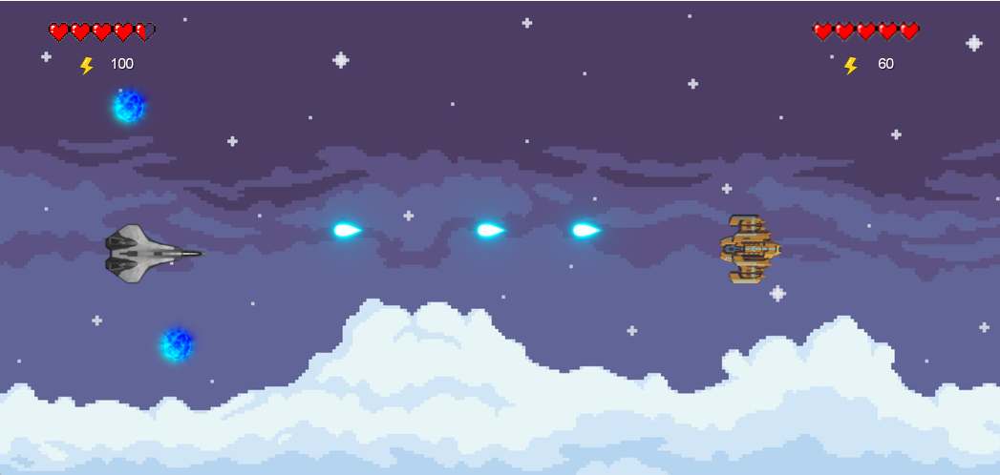

# Star Spaceships

## Equipo de desarrollo

- Camila Piraneo
- Lucas Gonzalez
- Nicolás Ceballos

## Capturas

 

## Reglas de Juego / Instrucciones

Un juego de batallas entre naves espaciales que tiene la posibilidad de jugar individualmente, contra la máquina, o entre dos jugadores que jugarán en el mismo teclado. El objetivo del juego es lograr sobrevivir a la batalla y derribar al enemigo. El primer jugador que derribe a la nave contraria, gana. Las instrucciones del juego aparecerán en pantalla para cada jugador.
-  El juego va a contar con 2 o más mapas distintos donde jugar, en los cuales habrá una división de pantalla vertical. Esto quiere decir que cada jugador podrá moverse dentro de su sección, apuntando siempre al otro jugador. Los jugadores tendrán la posibilidad de elegir su propia nave, entre las que vayamos agregando.
-  Las naves podrá moverse en la dirección que el jugador desee pero apuntando siempre a la dirección en donde se encuentre el otro jugador de manera horizontal.
-  Las naves van a contar con distintos disparos, uno base y algún que otro más (como disparo en ráfaga o disparo explosivo) que deberán de tener su propia energía cada uno.
-  La energía de las naves se gasta con cada disparo, y se podrá recuperar con orbes de energía que aparecerán en el mapa al azar. Sólo el disparo base cada cierto tiempo podrá recuperarse sólo (o con un orbe de energía base), pero los demás disparos sólo podrán restablecerse agarrando los orbes de recarga de energía especial para esos disparos.
-  La vida de las naves bajará con cada disparo enemigo, y la misma podrá recuperarse con una llavecita de reparación que aparecerá al azar en el mapa al igual que los orbes de energía.

## Otros

- Una vez terminado, no tenemos problemas en que el repositorio sea público / queremos manternerlo privado
